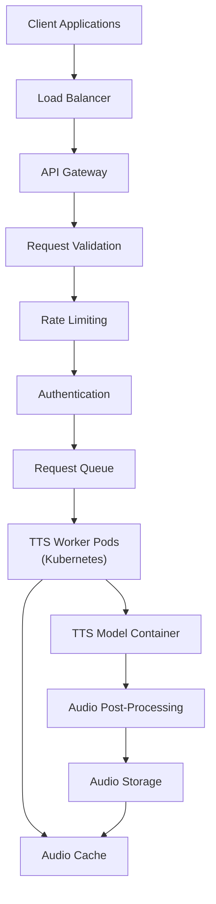

# Ръководство за извеждане с TTS модел


Успешно сте обучили или донастроили TTS модел и сте избрали обещаващ checkpoint. Сега можете да използвате този модел, за да превръщате нов текст в реч, процес, който обикновено се нарича **inference** или **synthesis**.

Ако някой термин за inference или deployment е неясен, използвайте [речника](../glossary.md#glossary-of-technical-terms). Тук са обяснени само термините, които пряко влияят върху генерирането, оценката или споделянето на модела.

---

## Извеждане: синтезиране на реч

Тази част обяснява как да стартирате inference с обучения модел.

### Намерете inference скрипта и подходящия checkpoint

-   **Inference скрипт:** Потърсете Python скрипт като `inference.py`, `synthesize.py`, `infer.py` или `tts.py`. Името и аргументите се различават между рамките.
-   **Най-добър checkpoint:** Намерете checkpoint файла (`.pth`, `.pt`, `.ckpt`), който искате да използвате. Най-често това е `best_model.pth` или друг checkpoint, избран след слушане на validation sample-и.
-   **Конфигурационен файл:** Почти винаги ще ви трябва същият `.yaml` или `.json` config, който е използван по време на обучението на този checkpoint. Ако config и checkpoint не съвпадат, често ще получите грешка при зареждане или лош изход.

### Основно извеждане за едно изречение

-   **Цел:** Да генерирате аудио за едно кратко изречение, подадено от командния ред.

    ```bash
    python inference.py \
      --config ../checkpoints/my_yoruba_voice_run1/config.yaml \
      --checkpoint_path ../checkpoints/my_yoruba_voice_run1/best_model.pth \
      --text "Hello, this is a test of my custom trained voice." \
      --output_wav_path ./output_sample.wav
      # По избор:
      # --speaker_id "main_speaker"
      # --device "cuda"
    ```

-   **Основни аргументи:**
    *   `--config` или `-c`: Път до training config файла.
    *   `--checkpoint_path` или `--model_path`: Път до checkpoint файла.
    *   `--text` или `-t`: Входният текст за синтез.
    *   `--output_wav_path` или `--out_path`: Къде да се запише генерираният WAV файл.
    *   `--speaker_id`: Нужен е при многоговорителни модели.
    *   `--device`: Обикновено `cuda`, ако е налично, иначе `cpu`.

#### Първи smoke test за inference

При първия тест не започвайте с дълъг абзац или голям batch файл. Използвайте едно кратко изречение, например:

```text
Hello, this is a short test sentence.
```

Ако това не работи, оправете базовия pipeline първо. Пакетното извеждане няма да поправи грешен config, грешен checkpoint или грешен speaker ID.

### Пакетно извеждане от текстов файл

-   **Цел:** Да синтезирате няколко изречения от текстов файл и да ги запишете като отделни WAV файлове.
-   **Подгответе входния файл:** Направете `sentences.txt`, в който всеки ред е отделно изречение.

    ```text
    This is the first sentence.
    Here is another sentence to synthesize.
    The model should handle different punctuation marks, like questions?
    And also exclamations!
    ```

-   **Примерна команда:**

    ```bash
    python inference_batch.py \
      --config ../checkpoints/my_yoruba_voice_run1/config.yaml \
      --checkpoint_path ../checkpoints/my_yoruba_voice_run1/best_model.pth \
      --input_file sentences.txt \
      --output_dir ./generated_batch_audio/
      # По избор:
      # --speaker_id "main_speaker"
      # --device "cuda"
    ```

-   **Ключови аргументи:**
    *   `--input_file` или `--text_file`: Път до текстовия файл.
    *   `--output_dir` или `--out_dir`: Папка за генерираните WAV файлове.
    *   Останалите аргументи са подобни на single sentence inference.

### Извеждане при многоговорителни модели

-   Ако моделът е обучен върху данни от няколко говорителя, **трябва** да зададете кой говорител искате.
-   Използвайте `--speaker_id` със същия идентификатор, който сте използвали в manifest файловете.
-   Ако пропуснете `speaker_id`, inference скриптът може да върне грешка, да използва speaker 0 по подразбиране или да даде размит резултат.

### Разширени контроли за inference

-   Някои рамки поддържат допълнителни параметри:
    *   **Скорост на речта:** `--speed` или `--length_scale`
    *   **Контрол на pitch**
    *   **Стил или емоция:** `--style_text`, `--style_wav` и подобни
    *   **Настройки на вокодера**
    *   **Параметри за diffusion step-ове**
-   Винаги проверявайте `python inference.py --help` и документацията на конкретната рамка.

### Чести проблеми при inference

-   **CUDA Out-of-Memory:** Много дългите изречения могат да използват повече памет от очакваното.
-   **Несъответствие между model и config:** Много често срещана причина за счупен изход.
-   **Грешен speaker ID:** Особено при multi-speaker модели.
-   **Лошо качество на звука:** Върнете се към Ръководство 1 и Ръководство 3, ако изходът е шумен, нестабилен или неразбираем.

---

## По избор: оценка и deployment

Тази секция е нарочно по избор. Ако сте начинаещи, не блокирайте върху MOS тестове, ASR метрики или production deployment преди да можете надеждно да генерирате няколко добри локални sample-а.

За повечето лични и първи проекти локалното слушане е достатъчно, за да решите дали даден checkpoint си струва да бъде запазен. Приемайте метриките по-долу като инструменти за сравнение и дебъгване, а не като задължително условие за използване на модела.

### Оценка на качеството на TTS модела

Субективното слушане остава най-важният критерий, но някои обективни метрики могат да помогнат.

#### Обективни метрики за оценка

| Метрика | Какво измерва | Инструмент или реализация | Тълкуване |
|:--------|:--------------|:--------------------------|:----------|
| **MOS (Mean Opinion Score)** | Общо възприемано качество | Хора оценяват sample-ите по скала 1-5 | По-високо е по-добре; изисква оценители |
| **PESQ** | Качество спрямо референтен запис | Python пакет `pypesq` | Диапазон -0.5 до 4.5; по-високо е по-добре |
| **STOI** | Разбираемост на речта | Python пакет `pystoi` | Диапазон 0 до 1; по-високо е по-добре |
| **CER / WER** | Разбираемост чрез ASR | Пуснете ASR върху синтезираната реч и сравнете с входния текст | По-ниско е по-добре |
| **MCD** | Спектрално разстояние спрямо референция | Собствена реализация с `librosa` | По-ниско е по-добре; често 2-8 при TTS |
| **F0 RMSE** | Точност на pitch-а | Собствена реализация с `librosa` | По-ниско е по-добре; измерва точността на pitch контура |
| **Voicing Decision Error** | Точност на voiced/unvoiced решенията | Собствена реализация | По-ниско е по-добре |

#### Практичен подход за оценка

1. Подгответе кратък набор от тестови изречения, които не са използвани при обучението.
2. Генерирайте sample-и с избрания checkpoint.
3. Прослушайте ги за естественост, стабилност, произношение и правилен говорител.
4. Ако е нужно, добавете обективни метрики като вторичен сигнал, а не като единствен критерий.

**Практична бележка:** този подход е за експерименти, а не готов production pipeline. Започнете с малък и постоянен набор за слушане и добавете обективни метрики само ако ви трябват по-ясни сравнения между checkpoint-и или версии.

### Deployment на TTS модели

**Бележка за обхвата:** deployment е отделен инженерен проблем. Ако още оправяте произношение, нестабилност или объркан говорител, продължете локално преди да мислите за production.

**Практично правило:** не започвайте с Kubernetes, autoscaling или serverless инфраструктура, преди да имате стабилна локална inference команда и повторяем начин за зареждане на модела. Локалната надеждност е първа.

#### Основни съображения за production deployment

1. **Оптимизация на модела:** Quantization намалява точността от FP32 към FP16 или INT8; pruning премахва ненужни тегла; distillation обучава по-малък student модел; ONNX подобрява преносимостта.
2. **Оптимизация на латентността:** Използвайте batch processing за несинхронни заявки, streaming за реално време, caching за чести фрази и GPU/TPU ускорение.
3. **Мащабируемост:** Docker пакетира модела и зависимостите, Kubernetes оркестрира контейнерите, autoscaling настройва ресурсите според натоварването, а request queues поемат пикове.
4. **Наблюдение и поддръжка:** Следете latency, throughput, error rates, използването на ресурсите, качеството на изхода и A/B тестовете между версии.

#### Примерна production deployment архитектура



#### Локални варианти за deployment

За много поддържащи проекта малък wrapper скрипт или лек Gradio demo са достатъчни за дълго време. Не ви е необходим production stack само за да използвате модела локално или да го покажете на няколко тестери.

1. **Команден интерфейс:** скрипт, който обгръща inference кода и приема `--text`, `--model`, `--config`, `--output` и `--speaker` аргументи.
2. **Прост уеб интерфейс:** базов интерфейс с Flask или Gradio, който зарежда модела при стартиране и връща генерирания аудио файл.
3. **Gradio demo:** подходящ за локално тестване или бързо споделяне на модел с тестери.

#### Облачни варианти за deployment

За production употреба разгледайте:

1. **Hugging Face Spaces:** качете модела и създайте Gradio или Streamlit приложение.
2. **REST API:** обвийте модела във FastAPI или Flask приложение и го разположете в облачна услуга.
3. **Serverless функции:** подходящи за по-леки модели.
4. **Docker контейнери:** пакетирайте модела и зависимостите за по-предсказуемо разгръщане.

#### Оптимизация на производителността

За да подобрите скоростта и ефективността на inference:

1. **Quantization:** преобразувайте теглата към FP16 или INT8.
2. **ONNX export:** конвертирайте PyTorch модела за по-бърз inference.
3. **Batch processing:** обработвайте няколко текстови входа наведнъж за по-висок throughput.
4. **Caching:** кеширайте често заявявани фрази, за да не ги генерирате повторно.
5. **По-кратки входове:** използвайте предвидими inference входове за по-нисък latency.

Сега, когато можете да генерирате реч с обучения модел, следващата логична стъпка е да организирате файловете на модела за по-лесно бъдещо използване, споделяне или deployment.

## Преди да продължите

- [ ] Checkpoint файлът и config файлът са от едно и също training изпълнение.
- [ ] Тествали сте едно кратко изречение преди голям batch job.
- [ ] Output пътят или output папката съществува и е записваема.
- [ ] Подали сте правилния speaker ID при multi-speaker модел, ако е нужен.
- [ ] Ако звукът е грешен, проверили сте sampling rate, config съвпадение и избора на checkpoint преди да променяте inference текста.
