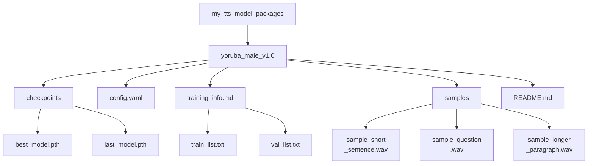

# Ръководство за пакетиране и споделяне на TTS модел


Обучили сте модел и можете да генерирате реч с него. За да остане този персонализиран TTS модел използваем и в бъдеще, и за да е по-лесно споделянето или възпроизводимостта, правилното пакетиране и документация са от съществено значение.

Ако някой термин за пакетиране или обучение не е ясен, използвайте [речника](../glossary.md#glossary-of-technical-terms). На тази страница се спираме само на понятията, които директно влияят на това дали друг човек може да зареди и да има доверие на пакета с модела.

---

## Пакетиране на вашия обучен модел

Мислете за обучен модел не просто като за един `.pth` файл, а като за пълен пакет, съдържащ всичко необходимо за разбиране и използване.

### Организирайте файловете на модела

Създайте чиста и самостоятелна структура на директориите за всеки отделен обучен модел или важна негова версия. Това ще ви помогне по-лесно да намерите всичко по-късно.

**Примерна структура:**



**Обяснение на ключовите компоненти:**

*   **`checkpoints/`**: Съдържа реалните тегла на модела. Винаги включвайте checkpoint файла, който считате за "най-добър", независимо дали по loss или по слухови тестове. Добра практика е да включите и финалния checkpoint.
*   **`config.yaml` (или `.json`)**: Абсолютно критичен файл. Той описва архитектурата на модела и параметрите, нужни за правилно зареждане и използване на checkpoint файла. Без него checkpoint файлът често е неизползваем. Уверете се, че това е *точната* конфигурация, използвана за включените checkpoint файлове.
*   **`training_info.md` / manifest файлове (по избор, но препоръчително)**: Съхраняването на manifest файловете помага да проследите точно с какви данни е обучен моделът. Файлът `training_info.md` може да съдържа бележки за обучението като продължителност, използван хардуер, крайни метрики и наблюдения.
*   **`samples/`**: Добавете няколко разнообразни аудио примера, генерирани от `best_model.pth`. Това бързо показва гласа, качеството и особеностите на модела.
*   **`README.md`**: Потребителското ръководство за този конкретен модел. Вижте следващата секция.

**Практично правило:** ако непознат човек не може лесно да разбере кой checkpoint, конфигурация, примерни файлове и условия на употреба принадлежат заедно, пакетът още не е готов.

### Минимален пакет, който може да се сподели

Ако все още не сте готови за напълно полиран публичен release, целете най-малкия пакет, който все пак е честен и възпроизводим:

- един ясно именуван checkpoint
- точната конфигурация, използвана с него
- 2 до 3 примерни изхода, генерирани от същия checkpoint
- кратък `README.md`, който обяснява framework-а, sampling rate, езика и обхвата на говорителя
- лиценз или бележка за употреба, която казва дали пакетът е публичен, ограничен или експериментален

Това обикновено е достатъчно, за да може сътрудник или тестер да зареди модела и да даде полезна обратна връзка, без да гадае кое към какво принадлежи.

### Как да напишете добър README.md за модела

Този README е специфичен за *този пакет на модела*, а не за цялото ръководство на проекта. Той трябва да казва на всеки, включително и на вас в бъдеще, всичко необходимо за използване на модела.

Мислете за този файл като за документ за предаване, а не като за маркетингов текст. Неговата задача е да намалява неяснотите.

**Минимален шаблон:**

```markdown
# TTS Model Package: Yoruba Male Voice v1.0

## Model Description
- **Voice:** Clear, adult male voice speaking Yoruba.
- **Source Data Quality:** Trained on ~25 hours of clean radio broadcast recordings.
- **Language(s):** Yoruba (primarily). May have limited handling of English loanwords based on training data.
- **Speaking Style:** Formal, narrative/broadcast style.
- **Model Architecture:** [Specify Framework/Architecture, e.g., StyleTTS2, VITS]
- **Version:** 1.0

## Training Details
- **Based On:** Fine-tuned from [Specify base model, e.g., pre-trained LibriTTS model] OR Trained from scratch.
- **Training Data:** See included `train_list.txt` and `val_list.txt`. Total hours: ~25h.
- **Key Training Config:** See included `config.yaml`.
- **Sampling Rate:** 22050 Hz (Input audio must match this rate for some frameworks).
- **Training Time:** [Optional] Rough training duration and hardware used, if you want to document reproducibility expectations.
- **Checkpoint Info:** `best_model.pth` selected based on lowest validation loss at step [XXXXX].

## How to Use for Inference
1.  **Prerequisites:** Ensure you have the [Specify TTS Framework Name, e.g., StyleTTS2] framework installed, compatible with this model version.
2.  **Configuration:** Use the included `config.yaml`.
3.  **Checkpoint:** Load the `checkpoints/best_model.pth` file.
4.  **Input Text:** Provide plain text input. Text normalization matching the training data (e.g., number expansion) might improve results.
5.  **Speaker ID (if applicable):** This is a single-speaker model. Use speaker ID `[Specify ID used, e.g., main_speaker]` if required by the framework, otherwise it might not be needed.
6.  **Expected Output:** Audio will be generated at 22050 Hz sampling rate.

## Audio Samples
Listen to examples generated by this model:
- [Short Sentence](./samples/sample_short_sentence.wav)
- [Question](./samples/sample_question.wav)
- [Longer Paragraph](./samples/sample_longer_paragraph.wav)

## Known Limitations / Notes
- Performance may degrade on text significantly different from the radio broadcast domain.
- Does not explicitly model nuanced emotions.
- [Add any other relevant observations]

## Licensing
- **Model Weights:** [Specify License, e.g., CC BY-NC-SA 4.0, Research/Non-Commercial Use Only, MIT License - Be accurate!]
- **Source Data:** [Mention source data license restrictions if they impact model usage, e.g., "Trained on proprietary data, model for internal use only."] **Consult the license of your training data!**
```

### Съвети за версиониране на модела

Третирайте обучените модели като софтуерни издания.

*   **Използвайте семантично версиониране (препоръчително):** Използвайте имена като `model_v1.0`, `model_v1.1`, `model_v2.0`.
    *   Увеличавайте PATCH версията (v1.0 -> v1.0.1) за малки корекции или преобучения със същите данни и конфигурация.
    *   Увеличавайте MINOR версията (v1.0 -> v1.1) за подобрения, преобучение с повече данни или по-съществени промени в конфигурацията.
    *   Увеличавайте MAJOR версията (v1.0 -> v2.0) за големи архитектурни промени или пълно преобучение с различни основни данни и цели.
*   **Актуализирайте README файловете:** Когато създавате нова версия, обновете README файла така, че да описва промените спрямо предишната версия.
*   **Пазете старите версии:** Не изхвърляйте веднага по-старите версии. Понякога стар модел може да работи по-добре за определен тип текст, или може да ви се наложи връщане назад, ако нова версия въведе регресия. Ако мястото позволява, архивирайте ги.

### Съображения при споделяне и разпространение

Ако планирате да споделяте модела:

*   **Пакетиране:** Създайте компресиран архив, например `.zip` или `.tar.gz`, на цялата директория на пакета на модела, включително checkpoint файлове, конфигурация, README, примери и други нужни файлове.
*   **Платформи за хостинг:**
    *   **Hugging Face Hub (Models):** Отлична платформа за споделяне на модели, с версиониране, model cards и понякога inference widgets. Лесна е за откриване и използване от други хора.
    *   **GitHub Releases:** Подходящо за по-малки модели. Можете да прикачите zip архива към release tag във вашето хранилище.
    *   **Облачно съхранение (Google Drive, Dropbox, S3):** Подходящо за директно споделяне, но е по-трудно откриваемо и няма добри функции за версиониране. Проверете дали настройките за достъп на линка са правилни.
*   **Лицензиране (критично):**
    *   **Вашият модел:** Изберете лиценз за *теглата* на модела, който разпространявате, например MIT, Apache 2.0 или CC BY-NC-SA.
    *   **Зависимост от данните:** **Лицензът на вашите тренировъчни данни често определя как можете да лицензирате обучения модел.** Ако сте тренирали с данни с некомерсиален лиценз, обикновено не можете да публикувате модела под свободен комерсиален лиценз. Ако сте използвали защитени с авторско право данни без разрешение, вероятно изобщо не трябва да споделяте модела публично. **Винаги проверявайте лицензите на източниците на данни.**
    *   **Лиценз на рамката:** Самият TTS framework има собствен лиценз, който е отделен от лиценза на вашия модел.
    *   **Ясно посочете условията на употреба:** Използвайте `README.md` в пакета на модела, за да посочите ясно предназначението и условията на използване.

**Предупреждение за целостта на примерите:** не пакетирайте демонстрационни аудио примери, генерирани от различен checkpoint от този, който разпространявате. Това веднага създава недоверие и прави възпроизводимостта и отстраняването на проблеми много по-трудни.

## Преди да споделите пакет на модел

- [ ] Checkpoint файлът и конфигурационният файл са от едно и също обучение.
- [ ] Примерните аудио файлове са генерирани от пакетирания checkpoint, а не от по-стара версия.
- [ ] README файлът на модела посочва езика, обхвата на говорителя, sampling rate и очаквания framework.
- [ ] Пакетът ясно описва лиценза или ограниченията за употреба както на теглата на модела, така и на тренировъчните данни.
- [ ] Проверили сте зареждането на пакета от финалната структура на директориите преди качване или архивиране.

---

Правилното пакетиране и документиране прави вашите модели значително по-ценни и използваеми, независимо дали ги пазите за бъдещи собствени проекти, или ги споделяте с други.
