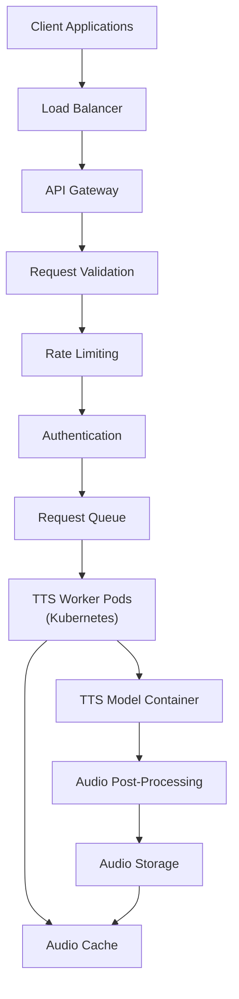

# Guía de Inferencia TTS


Has entrenado o hecho fine-tuning de un modelo TTS y ya tienes un checkpoint prometedor. Ahora puedes usar ese modelo para convertir texto nuevo en audio de voz, un proceso llamado **inferencia** o **síntesis**.

Si algún término de inferencia o despliegue no está claro, consulta el [glosario](../glossary.md#glossary-of-technical-terms). Esta página solo explica los términos que afectan directamente a la generación, evaluación o uso compartido del modelo.

---

## Inferencia: sintetizar voz

Esta sección explica cómo ejecutar la inferencia usando tu modelo entrenado.

### Localiza el script de inferencia y el checkpoint correcto

-   **Script de inferencia:** Busca un script como `inference.py`, `synthesize.py`, `infer.py` o `tts.py`. El nombre y los argumentos cambian según el framework.
-   **Checkpoint correcto:** Identifica el checkpoint (`.pth`, `.pt`, `.ckpt`) que quieres usar. Normalmente será `best_model.pth` u otro que hayas elegido tras escuchar muestras de validación.
-   **Archivo de configuración:** Casi siempre necesitarás el mismo archivo `.yaml` o `.json` usado durante el entrenamiento de ese checkpoint. Si el config y el checkpoint no coinciden, es normal obtener errores de carga o una salida basura.

### Inferencia básica de una sola frase

-   **Objetivo:** Generar audio para una frase corta proporcionada desde la línea de comandos.

    ```bash
    python inference.py \
      --config ../checkpoints/my_yoruba_voice_run1/config.yaml \
      --checkpoint_path ../checkpoints/my_yoruba_voice_run1/best_model.pth \
      --text "Hello, this is a test of my custom trained voice." \
      --output_wav_path ./output_sample.wav
      # Opcional:
      # --speaker_id "main_speaker"
      # --device "cuda"
    ```

-   **Argumentos principales:**
    *   `--config` o `-c`: Ruta al archivo de configuración.
    *   `--checkpoint_path` o `--model_path`: Ruta al checkpoint del modelo.
    *   `--text` o `-t`: Texto que quieres sintetizar.
    *   `--output_wav_path` o `--out_path`: Ruta del archivo WAV de salida.
    *   `--speaker_id`: Necesario en modelos multi-locutor.
    *   `--device`: Suele ser `cuda` si está disponible, si no `cpu`.

#### Primera prueba rápida de inferencia

Para la primera prueba no uses un párrafo largo ni un gran archivo por lotes. Usa una frase corta como:

```text
Hello, this is a short test sentence.
```

Si eso falla, arregla primero el pipeline básico. La inferencia por lotes no va a corregir un config roto, un checkpoint incorrecto o un speaker ID equivocado.

### Inferencia por lotes desde un archivo

-   **Objetivo:** Sintetizar varias frases desde un archivo de texto y guardarlas como WAV separados.
-   **Prepara el archivo de entrada:** Crea `sentences.txt` con una frase por línea.

    ```text
    This is the first sentence.
    Here is another sentence to synthesize.
    The model should handle different punctuation marks, like questions?
    And also exclamations!
    ```

-   **Comando de ejemplo:**

    ```bash
    python inference_batch.py \
      --config ../checkpoints/my_yoruba_voice_run1/config.yaml \
      --checkpoint_path ../checkpoints/my_yoruba_voice_run1/best_model.pth \
      --input_file sentences.txt \
      --output_dir ./generated_batch_audio/
      # Opcional:
      # --speaker_id "main_speaker"
      # --device "cuda"
    ```

-   **Argumentos clave:**
    *   `--input_file` o `--text_file`: Ruta al archivo de entrada.
    *   `--output_dir` o `--out_dir`: Carpeta donde guardar los WAV generados.
    *   El resto de argumentos suele ser igual que en la inferencia de una sola frase.

### Inferencia en modelos multi-locutor

-   Si el modelo fue entrenado con varios locutores, **debes** indicar qué voz quieres usar.
-   Utiliza `--speaker_id` con el mismo identificador que aparece en tus manifest de entrenamiento.
-   Si omites el `speaker_id`, el script puede fallar, usar un locutor por defecto o generar un resultado mezclado.

### Controles avanzados de inferencia

-   Algunos frameworks permiten parámetros extra como:
    *   **Velocidad de habla:** `--speed` o `--length_scale`
    *   **Control de pitch**
    *   **Estilo o emoción:** `--style_text`, `--style_wav`
    *   **Ajustes de vocoder**
    *   **Número de pasos en modelos de difusión**
-   Consulta siempre `python inference.py --help` y la documentación de tu framework.

### Problemas comunes de inferencia

-   **CUDA Out-of-Memory:** Las frases muy largas pueden usar más memoria de la esperada.
-   **Desajuste entre modelo y config:** Es una causa muy común de errores o audio defectuoso.
-   **Speaker ID incorrecto:** Especialmente en modelos multi-locutor.
-   **Calidad pobre:** Si el resultado es ruidoso o inestable, vuelve a la Guía 1 y la Guía 3.

---

## Opcional: evaluación y despliegue

Esta sección es intencionalmente opcional. Si estás empezando, no te bloquees con estudios MOS, métricas basadas en ASR o arquitectura de despliegue antes de poder generar unas cuantas muestras locales buenas.

Para la mayoría de proyectos personales o iniciales, las pruebas de escucha local bastan para decidir si merece la pena conservar un checkpoint. Trata las métricas siguientes como herramientas de comparación y depuración, no como un requisito previo para usar el modelo.

### Evaluar la calidad del modelo TTS

Las pruebas de escucha siguen siendo la referencia principal, pero algunas métricas objetivas pueden ayudarte a comparar resultados.

#### Métricas objetivas de evaluación

| Métrica | Qué mide | Herramienta o implementación | Interpretación |
|:--------|:---------|:-----------------------------|:---------------|
| **MOS (Mean Opinion Score)** | Calidad percibida global | Evaluadores humanos puntúan de 1 a 5 | Más alto es mejor; requiere evaluadores |
| **PESQ** | Calidad frente a una referencia | Disponible en Python mediante `pypesq` | Rango -0.5 a 4.5; más alto es mejor |
| **STOI** | Inteligibilidad del habla | Disponible en Python mediante `pystoi` | Rango 0 a 1; más alto es mejor |
| **CER / WER** | Inteligibilidad mediante ASR | Ejecuta ASR sobre el audio y compáralo con el texto | Más bajo es mejor |
| **MCD** | Distancia espectral frente a una referencia | Implementación propia con `librosa` | Más bajo es mejor; suele estar entre 2 y 8 en TTS |
| **F0 RMSE** | Precisión del pitch | Implementación propia con `librosa` | Más bajo es mejor; mide el contorno de pitch |
| **Voicing Decision Error** | Precisión de decisiones voiced/unvoiced | Implementación propia | Más bajo es mejor |

#### Enfoque práctico de evaluación

1. Prepara un pequeño conjunto de frases que no se usó en el entrenamiento.
2. Genera muestras con el checkpoint seleccionado.
3. Escúchalas para evaluar naturalidad, estabilidad, pronunciación y locutor correcto.
4. Si hace falta, añade métricas objetivas como apoyo, no como único criterio.

**Nota práctica:** este enfoque sirve para experimentar, no es un pipeline de evaluación listo para producción. Empieza escuchando un conjunto pequeño y constante, y añade métricas objetivas solo si necesitas comparar mejor checkpoints o versiones.

### Despliegue de modelos TTS

**Nota de alcance:** el despliegue es un problema de ingeniería distinto. Si todavía estás corrigiendo pronunciación, inestabilidad o mezcla de locutores, sigue trabajando localmente primero.

**Regla práctica:** no empieces con Kubernetes, auto-scaling o infraestructura serverless hasta tener un comando de inferencia local estable y una forma repetible de cargar el modelo. La fiabilidad local es lo primero.

#### Consideraciones principales para despliegue en producción

1. **Optimización del modelo:** quantization reduce la precisión de FP32 a FP16 o INT8; pruning elimina pesos innecesarios; distillation entrena un modelo pequeño a partir de uno mayor; ONNX mejora la portabilidad.
2. **Optimización de latencia:** usa batch processing para solicitudes no interactivas, streaming para tiempo real, caching para frases frecuentes y aceleración GPU/TPU.
3. **Escalabilidad:** Docker empaqueta el modelo y sus dependencias; Kubernetes orquesta contenedores; auto-scaling ajusta recursos; las colas absorben picos de solicitudes.
4. **Monitorización y mantenimiento:** mide latencia, throughput, tasas de error, uso de recursos, calidad de salida y diferencias entre versiones mediante pruebas A/B.

#### Arquitectura de ejemplo para despliegue en producción



#### Opciones locales de despliegue

Para muchos proyectos, un pequeño script wrapper o una demo ligera de Gradio son suficientes durante mucho tiempo. No necesitas un stack de producción para usar el modelo en tu máquina o compartir una demo con algunos testers.

1. **Interfaz de línea de comandos:** un script que envuelva el código de inferencia y acepte argumentos como `--text`, `--model`, `--config`, `--output` y `--speaker`.
2. **Interfaz web sencilla:** una interfaz básica con Flask o Gradio que cargue el modelo al iniciar y devuelva el audio generado.
3. **Demo de Gradio:** adecuada para probar localmente o compartir rápidamente el modelo con testers.

#### Opciones de despliegue en la nube

Para uso en producción, considera:

1. **Hugging Face Spaces:** sube el modelo y crea una aplicación con Gradio o Streamlit.
2. **REST API:** envuelve el modelo en una aplicación FastAPI o Flask y despliega en un servicio cloud.
3. **Funciones serverless:** adecuadas para modelos ligeros.
4. **Contenedores Docker:** empaqueta el modelo y las dependencias para un despliegue reproducible.

#### Optimización del rendimiento

Para mejorar la velocidad y eficiencia de la inferencia:

1. **Quantization:** convierte los pesos a FP16 o INT8.
2. **Exportación a ONNX:** convierte el modelo para acelerar la inferencia.
3. **Batch processing:** procesa varias entradas de texto a la vez para aumentar el throughput.
4. **Caché:** guarda las salidas solicitadas con frecuencia para evitar regenerarlas.
5. **Entradas más cortas:** usa entradas de inferencia previsibles para reducir la latencia.

Ahora que ya puedes generar voz con tu modelo entrenado, el siguiente paso lógico es organizar bien los archivos del modelo para su uso futuro, su compartición o su despliegue.

## Antes de continuar

- [ ] El checkpoint y el archivo de configuración provienen de la misma ejecución de entrenamiento.
- [ ] Has probado una frase corta antes de lanzar un trabajo grande por lotes.
- [ ] La ruta o carpeta de salida existe y tiene permisos de escritura.
- [ ] Has indicado el speaker ID correcto en modelos multi-locutor, si hace falta.
- [ ] Si el audio suena mal, has verificado sampling rate, coincidencia de config y selección del checkpoint antes de cambiar el texto de inferencia.
