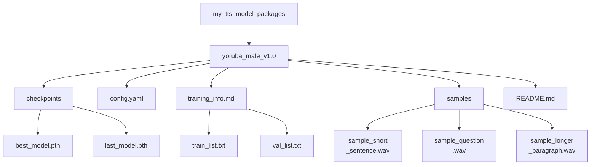

# Guía de Empaquetado y Compartición de Modelos TTS


Has entrenado un modelo y puedes generar voz con él. Para que ese modelo TTS personalizado siga siendo usable en el futuro, y para facilitar la compartición o la reproducibilidad, un empaquetado y una documentación adecuados son esenciales.

Si algún término de empaquetado o entrenamiento no te resulta claro, usa el [glosario](../glossary.md#glossary-of-technical-terms). Esta página solo se detiene en los términos que afectan directamente a que otra persona pueda cargar y confiar en tu paquete del modelo.

---

## Empaquetando tu Modelo Entrenado

Piensa en tu modelo entrenado no solo como un archivo `.pth`, sino como un paquete completo que contiene todo lo necesario para entenderlo y usarlo.

### Organiza los Archivos de tu Modelo

Crea una estructura de directorios limpia y autocontenida para cada modelo entrenado distinto o cada versión importante. Esto facilita encontrar todo más adelante.

**Estructura de Ejemplo:**



**Componentes Clave Explicados:**

*   **`checkpoints/`**: Contiene los pesos reales del modelo. Incluye siempre el checkpoint considerado el "mejor", ya sea por loss o por pruebas de escucha. Incluir también el checkpoint final es una buena práctica.
*   **`config.yaml` (o `.json`)**: Absolutamente crítico. Este archivo define la arquitectura del modelo y los parámetros necesarios para cargar y usar correctamente el checkpoint. Sin él, el checkpoint a menudo es inutilizable. Asegúrate de que sea la configuración *exacta* usada para los checkpoints incluidos.
*   **`training_info.md` / manifests (opcional pero recomendado)**: Guardar los manifests ayuda a rastrear exactamente con qué datos se entrenó el modelo. Un `training_info.md` puede contener notas sobre la ejecución del entrenamiento, duración, hardware usado, métricas finales y observaciones.
*   **`samples/`**: Incluye algunos ejemplos de audio diversos generados por `best_model.pth`. Esto demuestra rápidamente la identidad de la voz, la calidad y las características del modelo.
*   **`README.md`**: El manual de usuario de este paquete de modelo específico. Consulta la siguiente sección.

**Regla práctica:** si una persona ajena no puede identificar con claridad qué checkpoint, configuración, muestras y condiciones de uso pertenecen juntas, el paquete todavía no está listo.

### Paquete Mínimo Compartible

Si aún no estás listo para una publicación pública pulida, apunta al paquete más pequeño que siga siendo honesto y reproducible:

- un checkpoint con un nombre claro
- la configuración exacta usada con ese checkpoint
- 2 o 3 muestras de salida generadas con ese mismo checkpoint
- un `README.md` breve que explique framework, sampling rate, idioma y alcance del locutor
- una nota de licencia o de uso que indique si el paquete es público, restringido o experimental

Esto suele ser suficiente para que un colaborador o tester cargue el modelo y dé feedback útil sin tener que adivinar qué pertenece a qué.

### Cómo Escribir un Buen README.md del Modelo

Este README es específico de *este paquete de modelo*, no de la guía general del proyecto. Debe indicarle a cualquiera, incluido tu yo futuro, todo lo que necesita saber para usar el modelo.

Piensa en este archivo como un documento de entrega, no como texto de marketing. Su trabajo es reducir la ambigüedad.

**Plantilla Mínima:**

```markdown
# TTS Model Package: Yoruba Male Voice v1.0

## Model Description
- **Voice:** Clear, adult male voice speaking Yoruba.
- **Source Data Quality:** Trained on ~25 hours of clean radio broadcast recordings.
- **Language(s):** Yoruba (primarily). May have limited handling of English loanwords based on training data.
- **Speaking Style:** Formal, narrative/broadcast style.
- **Model Architecture:** [Specify Framework/Architecture, e.g., StyleTTS2, VITS]
- **Version:** 1.0

## Training Details
- **Based On:** Fine-tuned from [Specify base model, e.g., pre-trained LibriTTS model] OR Trained from scratch.
- **Training Data:** See included `train_list.txt` and `val_list.txt`. Total hours: ~25h.
- **Key Training Config:** See included `config.yaml`.
- **Sampling Rate:** 22050 Hz (Input audio must match this rate for some frameworks).
- **Training Time:** [Optional] Rough training duration and hardware used, if you want to document reproducibility expectations.
- **Checkpoint Info:** `best_model.pth` selected based on lowest validation loss at step [XXXXX].

## How to Use for Inference
1.  **Prerequisites:** Ensure you have the [Specify TTS Framework Name, e.g., StyleTTS2] framework installed, compatible with this model version.
2.  **Configuration:** Use the included `config.yaml`.
3.  **Checkpoint:** Load the `checkpoints/best_model.pth` file.
4.  **Input Text:** Provide plain text input. Text normalization matching the training data (e.g., number expansion) might improve results.
5.  **Speaker ID (if applicable):** This is a single-speaker model. Use speaker ID `[Specify ID used, e.g., main_speaker]` if required by the framework, otherwise it might not be needed.
6.  **Expected Output:** Audio will be generated at 22050 Hz sampling rate.

## Audio Samples
Listen to examples generated by this model:
- [Short Sentence](./samples/sample_short_sentence.wav)
- [Question](./samples/sample_question.wav)
- [Longer Paragraph](./samples/sample_longer_paragraph.wav)

## Known Limitations / Notes
- Performance may degrade on text significantly different from the radio broadcast domain.
- Does not explicitly model nuanced emotions.
- [Add any other relevant observations]

## Licensing
- **Model Weights:** [Specify License, e.g., CC BY-NC-SA 4.0, Research/Non-Commercial Use Only, MIT License - Be accurate!]
- **Source Data:** [Mention source data license restrictions if they impact model usage, e.g., "Trained on proprietary data, model for internal use only."] **Consult the license of your training data!**
```

### Consejos para el Versionado del Modelo

Trata tus modelos entrenados como lanzamientos de software.

*   **Usa Versionado Semántico (Recomendado):** Usa nombres como `model_v1.0`, `model_v1.1` o `model_v2.0`.
    *   Incrementa la versión PATCH (v1.0 -> v1.0.1) para correcciones menores o reentrenamientos con los mismos datos y configuración.
    *   Incrementa la versión MINOR (v1.0 -> v1.1) para mejoras, reentrenamiento con más datos o cambios importantes de configuración.
    *   Incrementa la versión MAJOR (v1.0 -> v2.0) para cambios grandes de arquitectura o reentrenamiento completo con datos y objetivos centrales distintos.
*   **Actualiza los README:** Al crear una nueva versión, actualiza el README para reflejar los cambios respecto a la versión anterior.
*   **Conserva las Versiones Antiguas:** No descartes inmediatamente las versiones anteriores. A veces un modelo previo puede rendir mejor con ciertos tipos de texto, o puede que necesites volver atrás si una nueva versión introduce regresiones. Si el almacenamiento lo permite, archívalas.

### Consideraciones de Compartición y Distribución

Si planeas compartir tu modelo:

*   **Empaquetado:** Crea un archivo comprimido, como `.zip` o `.tar.gz`, con toda la carpeta del paquete del modelo, incluyendo checkpoints, configuración, README, muestras y otros archivos necesarios.
*   **Plataformas de Alojamiento:**
    *   **Hugging Face Hub (Models):** Excelente plataforma para compartir modelos. Incluye versionado, model cards y, en algunos casos, widgets de inferencia. Además, facilita que otros lo descubran y lo utilicen.
    *   **GitHub Releases:** Adecuado para modelos más pequeños. Puedes adjuntar el archivo comprimido a una release en el repositorio del proyecto.
    *   **Almacenamiento en la nube (Google Drive, Dropbox, S3):** Simple para compartir directamente, pero menos descubrible y sin buenas funciones de versionado. Asegúrate de configurar correctamente los permisos del enlace.
*   **Licenciamiento (CRÍTICO):**
    *   **Tu Modelo:** Elige una licencia para los *pesos* del modelo que distribuyes, por ejemplo MIT, Apache 2.0 o CC BY-NC-SA.
    *   **Dependencia de los Datos:** **La licencia de tus datos de entrenamiento suele dictar cómo puedes licenciar tu modelo entrenado.** Si entrenaste con datos con una licencia no comercial, normalmente no puedes publicar tu modelo bajo una licencia comercial permisiva. Si entrenaste con datos protegidos por copyright sin permiso, probablemente no deberías compartir el modelo públicamente. **Comprueba siempre las licencias de tus fuentes de datos.**
    *   **Licencia del Framework:** El framework TTS tiene su propia licencia, separada de la licencia de tu modelo.
    *   **Indica Claramente los Términos de Uso:** Usa el `README.md` del paquete del modelo para explicar claramente el uso previsto y las condiciones de licencia.

**Advertencia sobre la integridad de las muestras:** no empaquetes audios de demostración generados con un checkpoint distinto del que estás distribuyendo. Eso genera desconfianza de inmediato y dificulta mucho más la reproducibilidad y la depuración.

## Antes de Compartir un Paquete de Modelo

- [ ] El checkpoint y el archivo de configuración provienen de la misma ejecución de entrenamiento.
- [ ] Los archivos de audio de muestra se generaron con el checkpoint empaquetado, no con una ejecución anterior.
- [ ] El README del modelo indica idioma, alcance de locutor, sampling rate y framework esperado.
- [ ] El paquete deja claras las restricciones de licencia o uso tanto de los pesos del modelo como de los datos de entrenamiento.
- [ ] Probaste cargar el paquete desde su estructura final de carpetas antes de subirlo o archivarlo.

---

Empaquetar y documentar correctamente tus modelos los hace mucho más valiosos y utilizables, ya sea para tus propios proyectos futuros o para colaboración y compartición con la comunidad.
