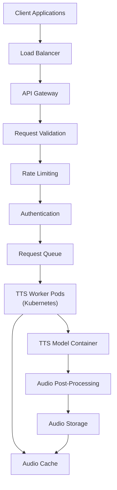

# Guide d'inférence TTS


Vous avez entraîné ou affiné un modèle TTS et vous avez maintenant un checkpoint prometteur. Vous pouvez donc utiliser ce modèle pour transformer un nouveau texte en parole, un processus souvent appelé **inférence** ou **synthèse**.

Si un terme lié à l'inférence ou au déploiement n'est pas clair, consultez le [glossaire](../glossary.md#glossary-of-technical-terms). Cette page n'explique que les termes qui influencent directement la génération, l'évaluation ou le partage du modèle.

---

## Inférence : synthétiser la parole

Cette section explique comment lancer l'inférence avec votre modèle entraîné.

### Localiser le script d'inférence et le bon checkpoint

-   **Script d'inférence :** Cherchez un script comme `inference.py`, `synthesize.py`, `infer.py` ou `tts.py`. Le nom et les arguments varient selon le framework.
-   **Bon checkpoint :** Identifiez le checkpoint (`.pth`, `.pt`, `.ckpt`) que vous souhaitez utiliser. Il s'agit souvent de `best_model.pth` ou d'un autre checkpoint choisi après écoute des échantillons de validation.
-   **Fichier de configuration :** Vous aurez presque toujours besoin du même fichier `.yaml` ou `.json` que celui utilisé pendant l'entraînement de ce checkpoint. Si la config et le checkpoint ne correspondent pas, vous obtiendrez souvent une erreur de chargement ou une sortie incohérente.

### Inférence basique sur une seule phrase

-   **Objectif :** Générer de l'audio pour une phrase courte fournie en ligne de commande.

    ```bash
    python inference.py \
      --config ../checkpoints/my_yoruba_voice_run1/config.yaml \
      --checkpoint_path ../checkpoints/my_yoruba_voice_run1/best_model.pth \
      --text "Hello, this is a test of my custom trained voice." \
      --output_wav_path ./output_sample.wav
      # Optionnel :
      # --speaker_id "main_speaker"
      # --device "cuda"
    ```

-   **Arguments principaux :**
    *   `--config` ou `-c` : Chemin du fichier de configuration.
    *   `--checkpoint_path` ou `--model_path` : Chemin du checkpoint du modèle.
    *   `--text` ou `-t` : Texte à synthétiser.
    *   `--output_wav_path` ou `--out_path` : Emplacement du fichier WAV de sortie.
    *   `--speaker_id` : Nécessaire pour les modèles multi-locuteurs.
    *   `--device` : Souvent `cuda` si disponible, sinon `cpu`.

#### Premier smoke test d'inférence

Pour le premier test, n'utilisez ni long paragraphe ni gros fichier batch. Utilisez une phrase courte comme :

```text
Hello, this is a short test sentence.
```

Si cela échoue, corrigez d'abord le pipeline de base. L'inférence par lots ne corrigera pas une mauvaise config, un mauvais checkpoint ou un mauvais speaker ID.

### Inférence par lots depuis un fichier

-   **Objectif :** Synthétiser plusieurs phrases depuis un fichier texte et les enregistrer comme fichiers WAV séparés.
-   **Préparez le fichier d'entrée :** Créez `sentences.txt` avec une phrase par ligne.

    ```text
    This is the first sentence.
    Here is another sentence to synthesize.
    The model should handle different punctuation marks, like questions?
    And also exclamations!
    ```

-   **Commande d'exemple :**

    ```bash
    python inference_batch.py \
      --config ../checkpoints/my_yoruba_voice_run1/config.yaml \
      --checkpoint_path ../checkpoints/my_yoruba_voice_run1/best_model.pth \
      --input_file sentences.txt \
      --output_dir ./generated_batch_audio/
      # Optionnel :
      # --speaker_id "main_speaker"
      # --device "cuda"
    ```

-   **Arguments clés :**
    *   `--input_file` ou `--text_file` : Chemin du fichier d'entrée.
    *   `--output_dir` ou `--out_dir` : Dossier de sortie pour les WAV générés.
    *   Les autres arguments sont généralement similaires à l'inférence sur une seule phrase.

### Inférence sur modèles multi-locuteurs

-   Si le modèle a été entraîné avec plusieurs locuteurs, vous **devez** indiquer quelle voix utiliser.
-   Utilisez `--speaker_id` avec le même identifiant que dans vos manifestes d'entraînement.
-   Si vous omettez `speaker_id`, le script peut échouer, utiliser un locuteur par défaut ou produire un résultat brouillé.

### Contrôles d'inférence avancés

-   Certains frameworks permettent des paramètres supplémentaires comme :
    *   **Vitesse de parole :** `--speed` ou `--length_scale`
    *   **Contrôle du pitch**
    *   **Style ou émotion :** `--style_text`, `--style_wav`
    *   **Réglages du vocoder**
    *   **Nombre d'étapes pour les modèles de diffusion**
-   Consultez toujours `python inference.py --help` et la documentation du framework concerné.

### Problèmes fréquents pendant l'inférence

-   **CUDA Out-of-Memory :** Les phrases très longues peuvent consommer plus de mémoire que prévu.
-   **Incompatibilité modèle/config :** Cause très courante d'erreur ou de mauvais audio.
-   **Mauvais speaker ID :** Surtout pour les modèles multi-locuteurs.
-   **Qualité médiocre :** Si le résultat est bruité ou instable, revenez au Guide 1 et au Guide 3.

---

## Optionnel : évaluation et déploiement

Cette section est volontairement optionnelle. Si vous débutez, ne bloquez pas sur les études MOS, les métriques ASR ou l'architecture de déploiement avant d'être capable de générer quelques bons échantillons locaux.

Pour la plupart des projets personnels ou initiaux, les tests d'écoute locaux suffisent pour décider s'il faut conserver un checkpoint. Considérez les métriques suivantes comme des outils de comparaison et de débogage, et non comme une condition obligatoire pour utiliser votre modèle.

### Évaluer la qualité du modèle TTS

L'écoute reste la référence principale, mais quelques métriques objectives peuvent aider à comparer les résultats.

#### Métriques objectives d'évaluation

| Métrique | Ce qu'elle mesure | Outil ou implémentation | Interprétation |
|:---------|:------------------|:------------------------|:---------------|
| **MOS (Mean Opinion Score)** | Qualité perçue globale | Des évaluateurs notent les échantillons de 1 à 5 | Plus haut est mieux ; nécessite des évaluateurs |
| **PESQ** | Qualité par rapport à une référence | Disponible en Python via `pypesq` | Plage -0,5 à 4,5 ; plus haut est mieux |
| **STOI** | Intelligibilité de la parole | Disponible en Python via `pystoi` | Plage 0 à 1 ; plus haut est mieux |
| **CER / WER** | Intelligibilité via ASR | Comparez la transcription ASR au texte d'entrée | Plus bas est mieux |
| **MCD** | Distance spectrale par rapport à une référence | Implémentation avec `librosa` | Plus bas est mieux ; souvent 2 à 8 en TTS |
| **F0 RMSE** | Précision de la hauteur | Implémentation avec `librosa` | Plus bas est mieux ; mesure le contour de hauteur |
| **Voicing Decision Error** | Précision voiced/unvoiced | Implémentation personnalisée | Plus bas est mieux |

#### Approche pratique d'évaluation

1. Préparez un petit ensemble de phrases non vues pendant l'entraînement.
2. Générez des échantillons avec le checkpoint choisi.
3. Écoutez-les pour juger du naturel, de la stabilité, de la prononciation et du bon locuteur.
4. Si nécessaire, ajoutez quelques métriques objectives comme signal secondaire, pas comme seul critère.

**Remarque pratique :** cette approche sert à l'expérimentation, et non à constituer un pipeline de production. Commencez par écouter un petit ensemble constant, puis ajoutez des métriques objectives seulement si vous devez mieux comparer des checkpoints ou des versions.

### Déploiement de modèles TTS

**Note de portée :** le déploiement est un problème d'ingénierie séparé. Si vous corrigez encore la prononciation, l'instabilité ou le mélange des locuteurs, continuez d'abord le travail en local.

**Règle pratique :** ne commencez pas par Kubernetes, l'auto-scaling ou une infrastructure serverless avant de disposer d'une commande d'inférence locale stable et d'une méthode reproductible pour charger le modèle. La fiabilité locale passe en premier.

#### Principales considérations pour un déploiement en production

1. **Optimisation du modèle :** la quantization réduit la précision de FP32 à FP16 ou INT8 ; le pruning supprime les poids inutiles ; la distillation entraîne un modèle plus petit à partir d'un modèle plus grand ; ONNX améliore la portabilité.
2. **Optimisation de la latence :** utilisez le batch processing pour les requêtes non interactives, le streaming en temps réel, le caching pour les phrases fréquentes et l'accélération GPU/TPU.
3. **Scalabilité :** Docker regroupe le modèle et ses dépendances ; Kubernetes orchestre les conteneurs ; l'auto-scaling adapte les ressources ; les files absorbent les pics de requêtes.
4. **Surveillance et maintenance :** mesurez la latence, le débit, les taux d'erreur, l'utilisation des ressources, la qualité de sortie et les différences entre versions avec des tests A/B.

#### Exemple d'architecture de déploiement en production



#### Options locales de déploiement

Pour de nombreux projets, un petit script wrapper ou une démo légère avec Gradio suffit longtemps. Vous n'avez pas besoin d'une stack de production pour utiliser le modèle sur votre machine ou le montrer à quelques testeurs.

1. **Interface en ligne de commande :** un script qui entoure le code d'inférence et accepte des arguments comme `--text`, `--model`, `--config`, `--output` et `--speaker`.
2. **Interface web simple :** une interface Flask ou Gradio qui charge le modèle au démarrage et renvoie l'audio généré.
3. **Démo Gradio :** adaptée aux tests locaux ou au partage rapide avec des testeurs.

#### Options de déploiement cloud

Pour un usage en production, envisagez :

1. **Hugging Face Spaces :** téléversez le modèle et créez une application Gradio ou Streamlit.
2. **REST API :** encapsulez le modèle dans une application FastAPI ou Flask et déployez-la dans un service cloud.
3. **Fonctions serverless :** adaptées aux modèles légers.
4. **Conteneurs Docker :** regroupez le modèle et ses dépendances pour un déploiement reproductible.

#### Optimisation des performances

Pour améliorer la vitesse et l'efficacité de l'inférence :

1. **Quantization :** convertissez les poids en FP16 ou INT8.
2. **Export ONNX :** convertissez le modèle pour accélérer l'inférence.
3. **Batch processing :** traitez plusieurs textes à la fois pour augmenter le débit.
4. **Cache :** conservez les sorties fréquemment demandées pour éviter de les régénérer.
5. **Entrées plus courtes :** utilisez des entrées prévisibles pour réduire la latence.

Maintenant que vous pouvez générer de la parole avec votre modèle entraîné, l'étape suivante logique consiste à organiser correctement les fichiers du modèle pour une utilisation future, le partage ou le déploiement.

## Avant de continuer

- [ ] Le checkpoint et le fichier de configuration proviennent de la même exécution d'entraînement.
- [ ] Vous avez testé une phrase courte avant de lancer un gros job batch.
- [ ] Le chemin ou le dossier de sortie existe et est accessible en écriture.
- [ ] Vous avez fourni le bon speaker ID pour les modèles multi-locuteurs, si nécessaire.
- [ ] Si l'audio sonne mal, vous avez vérifié le sampling rate, la correspondance de la config et le choix du checkpoint avant de changer le texte d'inférence.
