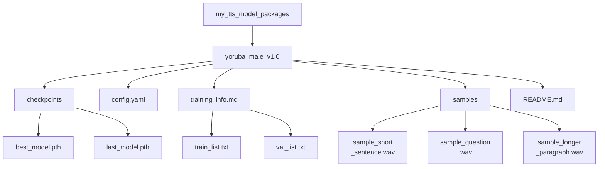

# Guide de packaging et de partage de modèles TTS


Vous avez entraîné un modèle et pouvez générer de la parole avec lui. Pour qu'un modèle TTS personnalisé reste utilisable à l'avenir, et pour faciliter le partage ou la reproductibilité, un packaging et une documentation appropriés sont essentiels.

Si un terme lié au packaging ou à l'entraînement n'est pas clair, utilisez le [glossaire](../glossary.md#glossary-of-technical-terms). Cette page ne s'arrête que sur les termes qui influencent directement la capacité d'une autre personne à charger votre package de modèle et à lui faire confiance.

---

## Packaging de votre modèle entraîné

Considérez votre modèle entraîné non pas comme un simple fichier `.pth`, mais comme un package complet contenant tout ce qui est nécessaire pour le comprendre et l'utiliser.

### Organiser les fichiers de votre modèle

Créez une structure de répertoires propre et autonome pour chaque modèle entraîné distinct ou pour chaque version importante. Cela permet de tout retrouver plus facilement plus tard.

**Exemple de structure :**



**Composants clés expliqués :**

*   **`checkpoints/`** : Contient les poids réels du modèle. Incluez toujours le checkpoint considéré comme le "meilleur", que ce soit selon la loss ou selon les tests d'écoute. Inclure le checkpoint final est aussi une bonne pratique.
*   **`config.yaml` (ou `.json`)** : Absolument critique. Ce fichier définit l'architecture du modèle et les paramètres nécessaires pour charger et utiliser correctement le checkpoint. Sans lui, le checkpoint est souvent inutilisable. Assurez-vous qu'il s'agit de la configuration *exacte* utilisée pour les checkpoints inclus.
*   **`training_info.md` / manifests (optionnel mais recommandé)** : Conserver les manifests aide à suivre exactement avec quelles données le modèle a été entraîné. Un `training_info.md` peut contenir des notes sur l'entraînement, la durée, le matériel utilisé, les métriques finales et les observations.
*   **`samples/`** : Incluez quelques exemples audio variés générés avec `best_model.pth`. Cela montre rapidement l'identité vocale, la qualité et les caractéristiques du modèle.
*   **`README.md`** : Le manuel d'utilisation de ce package de modèle spécifique. Voir la section suivante.

**Règle pratique :** si une personne extérieure ne peut pas comprendre clairement quel checkpoint, quelle configuration, quels échantillons et quelles conditions d'usage vont ensemble, le package n'est pas encore prêt.

### Package Minimum Partageable

Si vous n'êtes pas encore prêt pour une publication publique bien polie, visez le plus petit package qui reste honnête et reproductible :

- un checkpoint clairement nommé
- la configuration exacte utilisée avec ce checkpoint
- 2 à 3 échantillons de sortie générés avec ce même checkpoint
- un `README.md` court expliquant le framework, le sampling rate, la langue et le périmètre du locuteur
- une note de licence ou d'usage indiquant si le package est public, restreint ou expérimental

Cela suffit généralement pour qu'un collaborateur ou un testeur puisse charger le modèle et donner un retour utile sans devoir deviner ce qui va avec quoi.

### Rédiger un bon README.md de modèle

Ce README est spécifique à *ce package de modèle*, et non au guide global du projet. Il doit indiquer à n'importe qui, y compris à vous-même dans le futur, tout ce qu'il faut savoir pour utiliser le modèle.

Considérez ce fichier comme un document de passation, et non comme un texte marketing. Son rôle est de réduire l'ambiguïté.

**Modèle minimal :**

```markdown
# TTS Model Package: Yoruba Male Voice v1.0

## Model Description
- **Voice:** Clear, adult male voice speaking Yoruba.
- **Source Data Quality:** Trained on ~25 hours of clean radio broadcast recordings.
- **Language(s):** Yoruba (primarily). May have limited handling of English loanwords based on training data.
- **Speaking Style:** Formal, narrative/broadcast style.
- **Model Architecture:** [Specify Framework/Architecture, e.g., StyleTTS2, VITS]
- **Version:** 1.0

## Training Details
- **Based On:** Fine-tuned from [Specify base model, e.g., pre-trained LibriTTS model] OR Trained from scratch.
- **Training Data:** See included `train_list.txt` and `val_list.txt`. Total hours: ~25h.
- **Key Training Config:** See included `config.yaml`.
- **Sampling Rate:** 22050 Hz (Input audio must match this rate for some frameworks).
- **Training Time:** [Optional] Rough training duration and hardware used, if you want to document reproducibility expectations.
- **Checkpoint Info:** `best_model.pth` selected based on lowest validation loss at step [XXXXX].

## How to Use for Inference
1.  **Prerequisites:** Ensure you have the [Specify TTS Framework Name, e.g., StyleTTS2] framework installed, compatible with this model version.
2.  **Configuration:** Use the included `config.yaml`.
3.  **Checkpoint:** Load the `checkpoints/best_model.pth` file.
4.  **Input Text:** Provide plain text input. Text normalization matching the training data (e.g., number expansion) might improve results.
5.  **Speaker ID (if applicable):** This is a single-speaker model. Use speaker ID `[Specify ID used, e.g., main_speaker]` if required by the framework, otherwise it might not be needed.
6.  **Expected Output:** Audio will be generated at 22050 Hz sampling rate.

## Audio Samples
Listen to examples generated by this model:
- [Short Sentence](./samples/sample_short_sentence.wav)
- [Question](./samples/sample_question.wav)
- [Longer Paragraph](./samples/sample_longer_paragraph.wav)

## Known Limitations / Notes
- Performance may degrade on text significantly different from the radio broadcast domain.
- Does not explicitly model nuanced emotions.
- [Add any other relevant observations]

## Licensing
- **Model Weights:** [Specify License, e.g., CC BY-NC-SA 4.0, Research/Non-Commercial Use Only, MIT License - Be accurate!]
- **Source Data:** [Mention source data license restrictions if they impact model usage, e.g., "Trained on proprietary data, model for internal use only."] **Consult the license of your training data!**
```

### Conseils de versionnement des modèles

Traitez vos modèles entraînés comme des versions logicielles.

*   **Utiliser le versionnement sémantique (recommandé) :** Utilisez des noms comme `model_v1.0`, `model_v1.1` ou `model_v2.0`.
    *   Incrémentez la version PATCH (v1.0 -> v1.0.1) pour de petites corrections ou des réentraînements avec les mêmes données et la même configuration.
    *   Incrémentez la version MINOR (v1.0 -> v1.1) pour des améliorations, un réentraînement avec plus de données ou des ajustements importants de configuration.
    *   Incrémentez la version MAJOR (v1.0 -> v2.0) pour de grands changements d'architecture ou un réentraînement complet avec des données et objectifs centraux différents.
*   **Mettez à jour les README :** Lors de la création d'une nouvelle version, mettez à jour le README pour refléter les changements par rapport à la version précédente.
*   **Conservez les anciennes versions :** N'écartez pas immédiatement les versions précédentes. Il arrive qu'un ancien modèle fonctionne mieux sur certains textes, ou qu'il faille revenir en arrière si une nouvelle version introduit une régression. Si le stockage le permet, archivez-les.

### Considérations relatives au partage et à la distribution

Si vous prévoyez de partager votre modèle :

*   **Packaging :** Créez une archive compressée comme `.zip` ou `.tar.gz` contenant tout le répertoire du package de modèle, y compris les checkpoints, la configuration, le README, les échantillons et les autres fichiers nécessaires.
*   **Plateformes d'hébergement :**
    *   **Hugging Face Hub (Models) :** Excellente plateforme pour partager des modèles. Elle comprend le versionnement, les model cards et parfois des widgets d'inférence. Elle facilite aussi la découverte et la réutilisation du modèle.
    *   **GitHub Releases :** Convient aux modèles plus petits. Vous pouvez attacher l'archive à une release dans le dépôt du projet.
    *   **Stockage cloud (Google Drive, Dropbox, S3) :** Simple pour le partage direct, mais moins facile à découvrir et sans bonnes fonctions de versionnement. Vérifiez bien les permissions des liens.
*   **Licences (CRITIQUE) :**
    *   **Votre modèle :** Choisissez une licence pour les *poids* du modèle que vous distribuez, comme MIT, Apache 2.0 ou CC BY-NC-SA.
    *   **Dépendance aux données :** **La licence de vos données d'entraînement dicte souvent la manière dont vous pouvez licencier votre modèle entraîné.** Si vous avez entraîné sur des données avec une licence non commerciale, vous ne pouvez généralement pas publier le modèle sous une licence commerciale permissive. Si vous avez utilisé des données protégées sans autorisation, vous ne devriez probablement pas partager le modèle publiquement. **Vérifiez toujours les licences de vos sources de données.**
    *   **Licence du framework :** Le framework TTS lui-même possède sa propre licence, distincte de celle de votre modèle.
    *   **Indiquez clairement les conditions d'utilisation :** Utilisez le `README.md` du package du modèle pour décrire clairement l'usage prévu et les conditions de licence.

**Avertissement sur l'intégrité des échantillons :** n'empaquetez pas des exemples audio de démonstration générés avec un autre checkpoint que celui que vous distribuez. Cela crée immédiatement de la méfiance et rend la reproductibilité ainsi que le débogage beaucoup plus difficiles.

## Avant de partager un package de modèle

- [ ] Le checkpoint et le fichier de configuration proviennent de la même session d'entraînement.
- [ ] Les fichiers audio d'exemple ont été générés à partir du checkpoint empaqueté, et non d'une ancienne exécution.
- [ ] Le README du modèle indique la langue, le périmètre du locuteur, le sampling rate et le framework attendu.
- [ ] Le package indique clairement les restrictions de licence ou d'usage pour les poids du modèle et les données d'entraînement.
- [ ] Vous avez testé le chargement du package depuis sa structure finale de dossiers avant l'upload ou l'archivage.

---

Un packaging et une documentation appropriés rendent vos modèles bien plus utiles et réutilisables, que ce soit pour vos propres projets futurs ou pour la collaboration et le partage avec la communauté.
