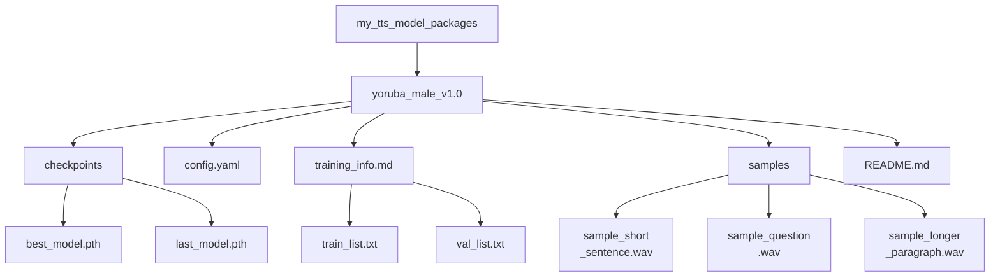

# TTS Model Packaging and Sharing Guide


You have trained a model and can generate speech with it. To keep that custom TTS model usable in the future, and to make sharing or reproducibility easier, proper packaging and documentation are essential.

If a packaging or training term feels unclear while you read, use the [glossary](../glossary.md#glossary-of-technical-terms). This page only pauses to explain terms that directly affect whether someone else can load and trust your model package.

---

## Packaging Your Trained Model

Think of your trained model not just as a single `.pth` file, but as a complete package containing everything needed to understand and use it.

### Organize Your Model Files

Create a clean, self-contained directory structure for each distinct trained model or significant version. This makes it easy to find everything later.

**Example Structure:**



**Key Components Explained:**

*   **`checkpoints/`**: Contains the actual model weights. Always include the [checkpoint](../glossary.md#glossary-checkpoint) you consider best, whether that judgment came from [validation loss](../glossary.md#glossary-validation-loss) or listening tests. Including the final checkpoint is also useful if you may need to compare or resume later.
*   **`config.yaml` (or `.json`)**: Absolutely critical. This file defines the model architecture and parameters required to load and use the checkpoint correctly. Without it, the checkpoint is often unusable. Ensure it is the *exact* config used for the included checkpoints.
*   **`training_info.md` / Manifests (Optional but Recommended):** Storing the [manifest files](../glossary.md#glossary-manifest-file) helps track exactly what data the model was trained on. A `training_info.md` can hold notes about the training run, such as duration, hardware used, final metrics, and observations.
*   **`samples/`**: Include a few diverse audio examples generated by the `best_model.pth`. This quickly demonstrates the model's voice identity, quality, and characteristics.
*   **`README.md`**: The user manual for this specific model package. See next section.

**Practical rule:** if a stranger cannot tell which checkpoint, config, samples, and usage conditions belong together, the package is not ready yet.

### Minimum Shareable Package

If you are not ready for a polished public release yet, aim for the smallest package that is still honest and reproducible:

- one clearly named checkpoint
- the exact config used with that checkpoint
- 2 to 3 sample outputs generated from that same checkpoint
- a short `README.md` explaining framework, sampling rate, language, and speaker scope
- a license or usage note stating whether the package is public, restricted, or experimental

This is usually enough for a collaborator or tester to load the model and give useful feedback without guessing what belongs together.

### Writing a Good Model README.md

This README is specific to *this model package*, not the overall project guide. It should tell anyone (including your future self) everything they need to know to use the model.

Think of this file as a handoff document, not marketing copy. Its job is to reduce ambiguity.

**Minimal Template:**

```markdown
# TTS Model Package: Yoruba Male Voice v1.0

## Model Description
- **Voice:** Clear, adult male voice speaking Yoruba.
- **Source Data Quality:** Trained on ~25 hours of clean radio broadcast recordings.
- **Language(s):** Yoruba (primarily). May have limited handling of English loanwords based on training data.
- **Speaking Style:** Formal, narrative/broadcast style.
- **Model Architecture:** [Specify Framework/Architecture, e.g., StyleTTS2, VITS]
- **Version:** 1.0

## Training Details
- **Based On:** Fine-tuned from [Specify base model, e.g., pre-trained LibriTTS model] OR Trained from scratch.
- **Training Data:** See included `train_list.txt` and `val_list.txt`. Total hours: ~25h.
- **Key Training Config:** See included `config.yaml`.
- **Sampling Rate:** 22050 Hz (Input audio must match this rate for some frameworks).
- **Training Time:** [Optional] Rough training duration and hardware used, if you want to document reproducibility expectations.
- **Checkpoint Info:** `best_model.pth` selected based on lowest validation loss at step [XXXXX].

## How to Use for Inference
1.  **Prerequisites:** Ensure you have the [Specify TTS Framework Name, e.g., StyleTTS2] framework installed, compatible with this model version.
2.  **Configuration:** Use the included `config.yaml`.
3.  **Checkpoint:** Load the `checkpoints/best_model.pth` file.
4.  **Input Text:** Provide plain text input. Text normalization matching the training data (e.g., number expansion) might improve results.
5.  **Speaker ID (if applicable):** This is a single-speaker model. Use speaker ID `[Specify ID used, e.g., main_speaker]` if required by the framework, otherwise it might not be needed.
6.  **Expected Output:** Audio will be generated at 22050 Hz sampling rate.

## Audio Samples
Listen to examples generated by this model:
- [Short Sentence](./samples/sample_short_sentence.wav)
- [Question](./samples/sample_question.wav)
- [Longer Paragraph](./samples/sample_longer_paragraph.wav)

## Known Limitations / Notes
- Performance may degrade on text significantly different from the radio broadcast domain.
- Does not explicitly model nuanced emotions.
- [Add any other relevant observations]

## Licensing
- **Model Weights:** [Specify License, e.g., CC BY-NC-SA 4.0, Research/Non-Commercial Use Only, MIT License - Be accurate!]
- **Source Data:** [Mention source data license restrictions if they impact model usage, e.g., "Trained on proprietary data, model for internal use only."] **Consult the license of your training data!**
```

### Model Versioning Tips

Treat your trained models like software releases.

*   **Use Semantic Versioning (Recommended):** Use names like `model_v1.0`, `model_v1.1`, `model_v2.0`.
    *   Increment PATCH version (v1.0 -> v1.0.1) for minor fixes/retrains with same data/config.
    *   Increment MINOR version (v1.0 -> v1.1) for improvements, retraining with more data, significant config tweaks.
    *   Increment MAJOR version (v1.0 -> v2.0) for major architecture changes or complete retraining with different core data/goals.
*   **Update READMEs:** When creating a new version, update its README to reflect the changes from the previous version.
*   **Keep Old Versions:** Don't immediately discard older versions. Sometimes a previous model might perform better on specific types of text, or you might need to revert if a new version introduces regressions. Storage permitting, archive them.

### Sharing and Distribution Considerations

If you plan to share your model:

*   **Packaging:** Create a compressed archive (e.g., `.zip`, `.tar.gz`) of the entire model package directory (containing checkpoints, config, README, samples, etc.).
*   **Hosting Platforms:**
    *   **Hugging Face Hub (Models):** Excellent platform for sharing models, includes versioning, model cards (use your README content!), and potentially inference widgets. Easy for others to discover and use.
    *   **GitHub Releases:** Suitable for smaller models, attach the zip archive to a release tag in your project repository.
    *   **Cloud Storage (Google Drive, Dropbox, S3):** Simple for direct sharing, but less discoverable and lacks versioning features. Ensure link permissions are set correctly.
*   **Licensing (CRITICAL):**
    *   **Your Model:** Choose a license for the model *weights* you are distributing (e.g., MIT, Apache 2.0 for permissive; CC BY-NC-SA for non-commercial sharing).
    *   **Data Dependency:** **Crucially, the license of your training data often dictates how you can license your trained model.** If you trained on data with a non-commercial license, you generally cannot release your model under a permissive commercial license. If trained on copyrighted data without permission, you likely cannot share the model publicly at all. **Always check your data sources' licenses.**
    *   **Framework License:** The TTS framework code itself has its own license, which is separate from your model's license.
    *   **Clearly State Usage Terms:** Use the `README.md` within your model package to clearly state the intended use (e.g., research only, non-commercial, free for any use) and the license terms.

**Sample integrity warning:** Do not package showcase samples generated from a different checkpoint than the one you are distributing. That creates immediate mistrust and makes debugging much harder for anyone trying to reproduce your results.

## Before You Share a Model Package

- [ ] The checkpoint and config file come from the same training run.
- [ ] The sample audio files were generated from the packaged checkpoint, not from an older run.
- [ ] The model README states language, speaker scope, sampling rate, and expected framework.
- [ ] The package clearly states license or usage restrictions for both model weights and training data.
- [ ] You tested loading the package from its final folder structure before uploading or archiving it.

---

Properly packaging and documenting your models makes them significantly more valuable and usable, whether for your own future projects or for collaboration and sharing within the community.
