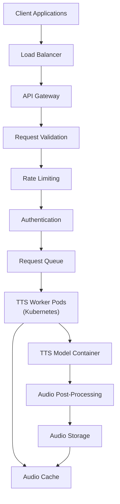

# Guida all'inferenza TTS


Hai addestrato o rifinito un modello TTS e ora hai un checkpoint promettente. A questo punto puoi usare quel modello per trasformare nuovo testo in parlato, un processo chiamato **inferenza** o **sintesi**.

Se un termine relativo all'inferenza o al deployment non è chiaro, consulta il [glossario](../glossary.md#glossary-of-technical-terms). Questa pagina spiega solo i termini che influenzano direttamente la generazione, la valutazione o la condivisione del modello.

---

## Inferenza: sintetizzare il parlato

Questa sezione spiega come eseguire l'inferenza usando il modello addestrato.

### Individuare lo script di inferenza e il checkpoint corretto

-   **Script di inferenza:** Cerca uno script come `inference.py`, `synthesize.py`, `infer.py` o `tts.py`. Nome e argomenti cambiano in base al framework.
-   **Checkpoint corretto:** Identifica il checkpoint (`.pth`, `.pt`, `.ckpt`) che vuoi usare. Di solito sarà `best_model.pth` oppure un altro checkpoint scelto dopo aver ascoltato i sample di validazione.
-   **File di configurazione:** Quasi sempre ti servirà lo stesso file `.yaml` o `.json` usato durante l'addestramento di quel checkpoint. Se config e checkpoint non combaciano, è normale ottenere errori di caricamento o output errato.

### Inferenza base su una singola frase

-   **Obiettivo:** Generare audio per una frase breve passata da riga di comando.

    ```bash
    python inference.py \
      --config ../checkpoints/my_yoruba_voice_run1/config.yaml \
      --checkpoint_path ../checkpoints/my_yoruba_voice_run1/best_model.pth \
      --text "Hello, this is a test of my custom trained voice." \
      --output_wav_path ./output_sample.wav
      # Opzionale:
      # --speaker_id "main_speaker"
      # --device "cuda"
    ```

-   **Argomenti principali:**
    *   `--config` o `-c`: Percorso del file di configurazione.
    *   `--checkpoint_path` o `--model_path`: Percorso del checkpoint del modello.
    *   `--text` o `-t`: Testo da sintetizzare.
    *   `--output_wav_path` o `--out_path`: Percorso del file WAV di output.
    *   `--speaker_id`: Necessario nei modelli multi-speaker.
    *   `--device`: In genere `cuda` se disponibile, altrimenti `cpu`.

#### Primo smoke test di inferenza

Per il primo test non partire da un paragrafo lungo o da un grande file batch. Usa una frase corta come:

```text
Hello, this is a short test sentence.
```

Se questo non funziona, sistema prima la pipeline di base. L'inferenza batch non correggerà un config sbagliato, un checkpoint errato o uno speaker ID non valido.

### Inferenza batch da file

-   **Obiettivo:** Sintetizzare più frasi da un file di testo e salvarle come WAV separati.
-   **Prepara il file di input:** Crea `sentences.txt` con una frase per riga.

    ```text
    This is the first sentence.
    Here is another sentence to synthesize.
    The model should handle different punctuation marks, like questions?
    And also exclamations!
    ```

-   **Comando di esempio:**

    ```bash
    python inference_batch.py \
      --config ../checkpoints/my_yoruba_voice_run1/config.yaml \
      --checkpoint_path ../checkpoints/my_yoruba_voice_run1/best_model.pth \
      --input_file sentences.txt \
      --output_dir ./generated_batch_audio/
      # Opzionale:
      # --speaker_id "main_speaker"
      # --device "cuda"
    ```

-   **Argomenti chiave:**
    *   `--input_file` o `--text_file`: Percorso del file di input.
    *   `--output_dir` o `--out_dir`: Cartella in cui salvare i WAV generati.
    *   Gli altri argomenti sono di solito simili a quelli dell'inferenza su singola frase.

### Inferenza per modelli multi-speaker

-   Se il modello è stato addestrato con più speaker, **devi** indicare quale voce usare.
-   Usa `--speaker_id` con lo stesso identificatore presente nei tuoi manifest di addestramento.
-   Se ometti `speaker_id`, lo script può fallire, usare uno speaker di default o produrre un risultato confuso.

### Controlli avanzati di inferenza

-   Alcuni framework permettono parametri aggiuntivi come:
    *   **Velocità del parlato:** `--speed` o `--length_scale`
    *   **Controllo del pitch**
    *   **Stile o emozione:** `--style_text`, `--style_wav`
    *   **Impostazioni del vocoder**
    *   **Numero di step nei modelli di diffusione**
-   Controlla sempre `python inference.py --help` e la documentazione del framework specifico.

### Problemi comuni di inferenza

-   **CUDA Out-of-Memory:** Le frasi molto lunghe possono usare più memoria del previsto.
-   **Mismatch tra modello e config:** È una causa molto comune di errori o audio errato.
-   **Speaker ID sbagliato:** Soprattutto nei modelli multi-speaker.
-   **Qualità scarsa:** Se il risultato è rumoroso o instabile, torna alla Guida 1 e alla Guida 3.

---

## Opzionale: valutazione e deployment

Questa sezione è volutamente opzionale. Se sei all'inizio, non bloccare il lavoro su studi MOS, metriche ASR o architettura di deployment prima di riuscire a generare alcuni buoni sample in locale.

Per la maggior parte dei progetti personali o iniziali, i test di ascolto locali sono sufficienti per decidere se vale la pena conservare un checkpoint. Considera le metriche seguenti strumenti di confronto e debug, non un requisito per usare il modello.

### Valutare la qualità del modello TTS

L'ascolto resta il criterio principale, ma alcune metriche oggettive possono aiutarti a confrontare i risultati.

#### Metriche oggettive di valutazione

| Metrica | Cosa misura | Strumento o implementazione | Interpretazione |
|:--------|:------------|:----------------------------|:----------------|
| **MOS (Mean Opinion Score)** | Qualità percepita complessiva | Valutatori umani assegnano un punteggio da 1 a 5 | Più alto è meglio; richiede valutatori |
| **PESQ** | Qualità rispetto a un riferimento | Disponibile in Python tramite `pypesq` | Intervallo -0,5-4,5; più alto è meglio |
| **STOI** | Intelligibilità del parlato | Disponibile in Python tramite `pystoi` | Intervallo 0-1; più alto è meglio |
| **CER / WER** | Intelligibilità tramite ASR | Confronta la trascrizione ASR con il testo di input | Più basso è meglio |
| **MCD** | Distanza spettrale rispetto a un riferimento | Implementazione con `librosa` | Più basso è meglio; spesso 2-8 nel TTS |
| **F0 RMSE** | Precisione del pitch | Implementazione con `librosa` | Più basso è meglio; misura il contorno del pitch |
| **Voicing Decision Error** | Precisione delle decisioni voiced/unvoiced | Implementazione personalizzata | Più basso è meglio |

#### Approccio pratico alla valutazione

1. Prepara un piccolo insieme di frasi non viste durante l'addestramento.
2. Genera sample con il checkpoint scelto.
3. Ascoltali per valutare naturalezza, stabilità, pronuncia e speaker corretto.
4. Se serve, aggiungi metriche oggettive come supporto, non come unico criterio.

**Nota pratica:** questo approccio serve alla sperimentazione, non è una pipeline di valutazione pronta per la produzione. Inizia ascoltando un piccolo insieme costante e aggiungi metriche oggettive solo se devi confrontare meglio checkpoint o versioni.

### Deployment di modelli TTS

**Nota di ambito:** il deployment è un problema di ingegneria separato. Se stai ancora correggendo pronuncia, instabilità o speaker mismatch, continua prima il lavoro in locale.

**Regola pratica:** non iniziare con Kubernetes, auto-scaling o infrastruttura serverless prima di avere un comando di inferenza locale stabile e un modo ripetibile per caricare il modello. L'affidabilità locale viene prima.

#### Considerazioni principali per il deployment in produzione

1. **Ottimizzazione del modello:** la quantization riduce la precisione da FP32 a FP16 o INT8; il pruning rimuove pesi inutili; la distillation addestra un modello più piccolo da uno maggiore; ONNX migliora la portabilità.
2. **Ottimizzazione della latenza:** usa batch processing per richieste non interattive, streaming in tempo reale, caching per frasi frequenti e accelerazione GPU/TPU.
3. **Scalabilità:** Docker raggruppa modello e dipendenze; Kubernetes orchestra i container; auto-scaling adatta le risorse; le code gestiscono i picchi di richieste.
4. **Monitoraggio e manutenzione:** misura latenza, throughput, tassi di errore, uso delle risorse, qualità dell'output e differenze tra versioni con test A/B.

#### Esempio di architettura di deployment in produzione



#### Opzioni locali di deployment

Per molti progetti, un piccolo script wrapper o una demo leggera con Gradio sono sufficienti a lungo. Non serve uno stack di produzione per usare il modello sulla propria macchina o mostrarlo a pochi tester.

1. **Interfaccia a riga di comando:** uno script che avvolge il codice di inferenza e accetta argomenti come `--text`, `--model`, `--config`, `--output` e `--speaker`.
2. **Interfaccia web semplice:** un'interfaccia Flask o Gradio che carica il modello all'avvio e restituisce l'audio generato.
3. **Demo Gradio:** adatta ai test locali o alla condivisione rapida con tester.

#### Opzioni cloud di deployment

Per l'uso in produzione, considera:

1. **Hugging Face Spaces:** carica il modello e crea un'applicazione Gradio o Streamlit.
2. **REST API:** avvolgi il modello in un'applicazione FastAPI o Flask e distribuiscila su un servizio cloud.
3. **Funzioni serverless:** adatte ai modelli leggeri.
4. **Container Docker:** raggruppa modello e dipendenze per un deployment riproducibile.

#### Ottimizzazione delle prestazioni

Per migliorare velocità ed efficienza dell'inferenza:

1. **Quantization:** converti i pesi in FP16 o INT8.
2. **Esportazione ONNX:** converti il modello per accelerare l'inferenza.
3. **Batch processing:** elabora più input di testo insieme per aumentare il throughput.
4. **Cache:** conserva gli output richiesti spesso per evitare di rigenerarli.
5. **Input più brevi:** usa input di inferenza prevedibili per ridurre la latenza.

Ora che puoi generare parlato con il tuo modello addestrato, il passo logico successivo è organizzare bene i file del modello per uso futuro, condivisione o deployment.

## Prima di continuare

- [ ] Il checkpoint e il file di configurazione provengono dalla stessa esecuzione di addestramento.
- [ ] Hai testato una frase breve prima di lanciare un grande job batch.
- [ ] Il percorso o la cartella di output esiste ed è scrivibile.
- [ ] Hai fornito lo speaker ID corretto nei modelli multi-speaker, se necessario.
- [ ] Se l'audio suona male, hai verificato sampling rate, corrispondenza del config e scelta del checkpoint prima di cambiare il testo di inferenza.
