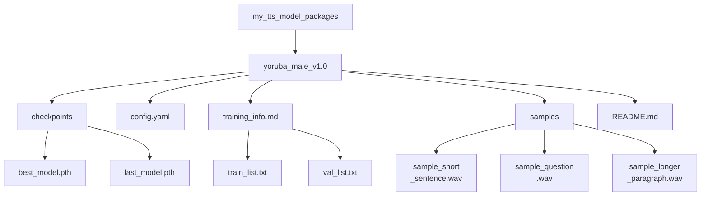

# Guida al packaging e alla condivisione di modelli TTS


Hai addestrato un modello e puoi generare parlato con esso. Per fare in modo che questo modello TTS personalizzato resti utilizzabile anche in futuro, e per rendere più semplice la condivisione o la riproducibilità, un packaging e una documentazione adeguati sono essenziali.

Se un termine legato al packaging o all'addestramento non ti è chiaro, usa il [glossario](../glossary.md#glossary-of-technical-terms). Questa pagina si ferma solo sui termini che incidono direttamente sulla possibilità che un'altra persona carichi il pacchetto del modello e si fidi di esso.

---

## Packaging del Tuo Modello Addestrato

Considera il tuo modello addestrato non solo come un singolo file `.pth`, ma come un pacchetto completo che contiene tutto il necessario per comprenderlo e utilizzarlo.

### Organizza i File del Tuo Modello

Crea una struttura di directory pulita e autonoma per ogni modello addestrato distinto o per ogni versione significativa. In questo modo sarà più facile ritrovare tutto in seguito.

**Esempio di Struttura:**



**Componenti Chiave Spiegati:**

*   **`checkpoints/`**: Contiene i pesi reali del modello. Includi sempre il checkpoint considerato il "migliore", sia in base al loss sia ai test di ascolto. Includere anche il checkpoint finale è una buona pratica.
*   **`config.yaml` (o `.json`)**: Assolutamente critico. Questo file definisce l'architettura del modello e i parametri necessari per caricare e usare correttamente il checkpoint. Senza di esso, il checkpoint è spesso inutilizzabile. Assicurati che sia la configurazione *esatta* usata per i checkpoint inclusi.
*   **`training_info.md` / manifest (opzionale ma consigliato)**: Salvare i manifest aiuta a tracciare esattamente con quali dati è stato addestrato il modello. Un file `training_info.md` può contenere note sull'addestramento, la durata, l'hardware usato, le metriche finali e altre osservazioni.
*   **`samples/`**: Includi alcuni esempi audio diversi generati da `best_model.pth`. Questo mostra rapidamente l'identità della voce, la qualità e le caratteristiche del modello.
*   **`README.md`**: Il manuale d'uso di questo specifico pacchetto del modello. Vedi la sezione successiva.

**Regola pratica:** se una persona esterna non riesce a capire chiaramente quali checkpoint, configurazione, campioni e condizioni d'uso appartengono insieme, il pacchetto non è ancora pronto.

### Pacchetto Minimo Condivisibile

Se non sei ancora pronto per una release pubblica rifinita, punta al pacchetto più piccolo che resti comunque onesto e riproducibile:

- un checkpoint con un nome chiaro
- la configurazione esatta usata con quel checkpoint
- 2 o 3 esempi di output generati da quello stesso checkpoint
- un breve `README.md` che spieghi framework, sampling rate, lingua e ambito dello speaker
- una nota di licenza o di utilizzo che dica se il pacchetto è pubblico, limitato o sperimentale

Questo di solito basta perché un collaboratore o un tester possa caricare il modello e dare feedback utile senza dover indovinare cosa appartiene a cosa.

### Scrivere un Buon README.md del Modello

Questo README è specifico per *questo pacchetto del modello*, non per la guida generale del progetto. Dovrebbe dire a chiunque, incluso il tuo io futuro, tutto ciò che serve sapere per usare il modello.

Pensa a questo file come a un documento di consegna, non come a un testo di marketing. Il suo compito è ridurre l'ambiguità.

**Template Minimo:**

```markdown
# TTS Model Package: Yoruba Male Voice v1.0

## Model Description
- **Voice:** Clear, adult male voice speaking Yoruba.
- **Source Data Quality:** Trained on ~25 hours of clean radio broadcast recordings.
- **Language(s):** Yoruba (primarily). May have limited handling of English loanwords based on training data.
- **Speaking Style:** Formal, narrative/broadcast style.
- **Model Architecture:** [Specify Framework/Architecture, e.g., StyleTTS2, VITS]
- **Version:** 1.0

## Training Details
- **Based On:** Fine-tuned from [Specify base model, e.g., pre-trained LibriTTS model] OR Trained from scratch.
- **Training Data:** See included `train_list.txt` and `val_list.txt`. Total hours: ~25h.
- **Key Training Config:** See included `config.yaml`.
- **Sampling Rate:** 22050 Hz (Input audio must match this rate for some frameworks).
- **Training Time:** [Optional] Rough training duration and hardware used, if you want to document reproducibility expectations.
- **Checkpoint Info:** `best_model.pth` selected based on lowest validation loss at step [XXXXX].

## How to Use for Inference
1.  **Prerequisites:** Ensure you have the [Specify TTS Framework Name, e.g., StyleTTS2] framework installed, compatible with this model version.
2.  **Configuration:** Use the included `config.yaml`.
3.  **Checkpoint:** Load the `checkpoints/best_model.pth` file.
4.  **Input Text:** Provide plain text input. Text normalization matching the training data (e.g., number expansion) might improve results.
5.  **Speaker ID (if applicable):** This is a single-speaker model. Use speaker ID `[Specify ID used, e.g., main_speaker]` if required by the framework, otherwise it might not be needed.
6.  **Expected Output:** Audio will be generated at 22050 Hz sampling rate.

## Audio Samples
Listen to examples generated by this model:
- [Short Sentence](./samples/sample_short_sentence.wav)
- [Question](./samples/sample_question.wav)
- [Longer Paragraph](./samples/sample_longer_paragraph.wav)

## Known Limitations / Notes
- Performance may degrade on text significantly different from the radio broadcast domain.
- Does not explicitly model nuanced emotions.
- [Add any other relevant observations]

## Licensing
- **Model Weights:** [Specify License, e.g., CC BY-NC-SA 4.0, Research/Non-Commercial Use Only, MIT License - Be accurate!]
- **Source Data:** [Mention source data license restrictions if they impact model usage, e.g., "Trained on proprietary data, model for internal use only."] **Consult the license of your training data!**
```

### Suggerimenti per il Versioning del Modello

Tratta i modelli addestrati come release software.

*   **Usa il versionamento semantico (consigliato):** Usa nomi come `model_v1.0`, `model_v1.1` o `model_v2.0`.
    *   Incrementa la versione PATCH (v1.0 -> v1.0.1) per piccole correzioni o riaddestramenti con gli stessi dati e la stessa configurazione.
    *   Incrementa la versione MINOR (v1.0 -> v1.1) per miglioramenti, riaddestramenti con più dati o modifiche importanti alla configurazione.
    *   Incrementa la versione MAJOR (v1.0 -> v2.0) per grandi cambiamenti architetturali o riaddestramenti completi con dati e obiettivi centrali diversi.
*   **Aggiorna i README:** Quando crei una nuova versione, aggiorna il README per riflettere i cambiamenti rispetto alla versione precedente.
*   **Conserva le Vecchie Versioni:** Non scartare subito le versioni più vecchie. A volte un modello precedente può funzionare meglio per certi tipi di testo, oppure potresti dover tornare indietro se una nuova versione introduce regressioni. Se lo spazio lo consente, archiviale.

### Considerazioni su Condivisione e Distribuzione

Se prevedi di condividere il modello:

*   **Packaging:** Crea un archivio compresso, come `.zip` o `.tar.gz`, dell'intera directory del pacchetto del modello, inclusi checkpoint, configurazione, README, campioni e altri file necessari.
*   **Piattaforme di Hosting:**
    *   **Hugging Face Hub (Models):** Ottima piattaforma per condividere modelli. Include versioning, model card e talvolta widget di inferenza. Inoltre rende il modello facile da scoprire e usare per altri.
    *   **GitHub Releases:** Adatto a modelli più piccoli. Puoi allegare l'archivio a una release del repository del progetto.
    *   **Cloud Storage (Google Drive, Dropbox, S3):** Semplice per la condivisione diretta, ma meno individuabile e senza buone funzioni di versioning. Controlla che i permessi dei link siano corretti.
*   **Licenze (CRITICO):**
    *   **Il Tuo Modello:** Scegli una licenza per i *pesi* del modello che distribuisci, come MIT, Apache 2.0 o CC BY-NC-SA.
    *   **Dipendenza dai Dati:** **La licenza dei tuoi dati di addestramento spesso determina come puoi licenziare il modello addestrato.** Se hai addestrato su dati con una licenza non commerciale, di solito non puoi pubblicare il modello con una licenza commerciale permissiva. Se hai usato dati protetti da copyright senza autorizzazione, probabilmente non dovresti condividere il modello pubblicamente. **Controlla sempre le licenze delle fonti di dati.**
    *   **Licenza del Framework:** Il framework TTS stesso ha la propria licenza, separata da quella del tuo modello.
    *   **Indica chiaramente i termini d'uso:** Usa il `README.md` del pacchetto del modello per spiegare chiaramente l'uso previsto e i termini di licenza.

**Avviso sull'integrità dei campioni:** non includere audio dimostrativi generati da un checkpoint diverso da quello che stai distribuendo. Questo crea subito sfiducia e rende molto più difficile sia la riproducibilità sia il debug.

## Prima di Condividere un Pacchetto del Modello

- [ ] Il checkpoint e il file di configurazione provengono dalla stessa esecuzione di addestramento.
- [ ] I file audio di esempio sono stati generati dal checkpoint incluso nel pacchetto, non da una versione precedente.
- [ ] Il README del modello indica lingua, ambito dello speaker, sampling rate e framework previsto.
- [ ] Il pacchetto dichiara chiaramente eventuali restrizioni di licenza o utilizzo sia per i pesi del modello sia per i dati di addestramento.
- [ ] Hai testato il caricamento del pacchetto dalla struttura finale delle cartelle prima dell'upload o dell'archiviazione.

---

Un packaging e una documentazione adeguati rendono i modelli molto più preziosi e riutilizzabili, sia per i tuoi progetti futuri sia per la collaborazione e la condivisione nella community.
